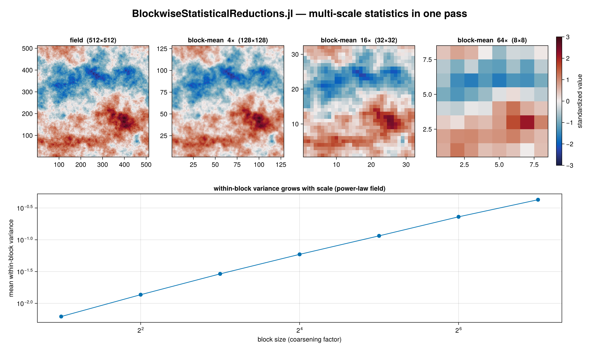

# BlockwiseStatisticalReductions.jl

A **purpose-agnostic** engine for computing statistics over N-dimensional data at *many coarser
scales at once* — efficiently, by reusing intermediate results so the data is touched as few times
as possible.

Give it an array and a set of scales; get back means / variances / covariances / extrema / moments
(or your own statistic) at every scale, computed in roughly a single pass over the data. Typical
uses: multi-scale features for ML training from high-resolution fields, image/volume pyramids,
downsampling of simulation or observational data, and any scale-dependent statistics.



```julia
using BlockwiseStatisticalReductions

data = randn(2048, 2048)

# mean and variance at 2×, 4×, 8×, …, 64× coarsening — one near-single-pass computation
r = reduce_stats(data, [2, 4, 8, 16, 32, 64]; stats = (Mean(), Var()))

r[(8, 8)].mean      # 256×256 array of block means at 8× coarsening
r[(8, 8)].var       # … and variances
factors(r)          # the scales present, finest first
```

## Why it is fast

Every statistic is a **mergeable monoid** over sufficient statistics: a coarse block is *exactly*
the `merge` of its finer child blocks. So the scales form a tree (a DAG over the divisor lattice of
block sizes), and each scale is built by coarsening the nearest finer scale already computed —
instead of re-reading the data once per scale.

```
=== 4096×4096, mean+var at scales [2,4,8,16,32,64] (8 threads) ===
  tower (serial):    305 ms
  naive independent: 1102 ms   (3.6× slower)
  tower (threaded):  106 ms    (2.9× vs serial tower)
  plan work / naive work = 0.222     # touches the data ~once, not once-per-scale
  steady-state allocations, variance tower: 0 bytes
```

The results are **numerically exact** (Welford + Chan/Pebay merges; never mean-pooling of child
variances), **type-stable**, and **allocation-free** at steady state — including for variance and
covariance.

## What it computes

Built-in statistics (compose any of them in one pass):

| Tag | Statistic |
|-----|-----------|
| `Count()` | number of elements per block |
| `Sum()` | sum |
| `Mean()` | mean |
| `Var(; corrected=true)` / `Std(; corrected=true)` | variance / standard deviation |
| `Cov(; corrected=true)` | covariance of a field pair |
| `Min()` / `Max()` | extrema |
| `Moments(K)` | raw moments `E[xᵏ]`, k = 1..K |

Requesting several statistics over the same field computes them together and shares work — e.g.
`(Count(), Sum(), Mean(), Var())` all come from a single variance accumulator.

## Scales

```julia
# explicit isotropic block sizes
reduce_stats(data, [4, 8, 16]; stats = (Mean(),))

# anisotropic / partial-dimension (factor 1 leaves a dimension unreduced)
reduce_stats(data, [(4, 4, 1), (8, 8, 1)]; stats = (Mean(),))

# a full tower: finest block, per-level multipliers, coarsest block
reduce_stats(data, Tower(base_factor = 2, steps = [2, 3], maxfactor = 64); stats = (Mean(), Std()))

# covariance of a field pair
reduce_stats(x, y, [8, 16]; stats = (Cov(),))

# overlapping (sliding) windows — stride < window; stride == window is blockwise
reduce_stats(data, [Sliding((16, 16); stride = (4, 4))]; stats = (Mean(), Var()))
```

## Backends

Selected with the `backend` keyword; all produce identical results.

```julia
reduce_stats(data, [4,8]; stats=(Var(),), backend = SerialBackend())          # default
reduce_stats(data, [4,8]; stats=(Var(),), backend = ThreadedBackend())        # using OhMyThreads
reduce_stats(data, [4,8]; stats=(Var(),), backend = DistributedBackend())     # using Distributed, SharedArrays
reduce_stats(data, [4,8]; stats=(Var(),), backend = AutoBackend())            # best available
```

`ThreadedBackend` requires `using OhMyThreads`; `DistributedBackend` requires
`using Distributed, SharedArrays`; a KernelAbstractions/CUDA GPU backend is planned.

## Zero-allocation repeated execution

For streaming / repeated calls, build the plan and buffers once and reuse them:

```julia
plan = tower_plan(size(data); base_factor = (2, 2), steps = ([2], [2]), maxfactor = (64, 64))
buf  = allocate_tower(plan, VarAcc{Float64})
for frame in frames
    run!(buf, plan, frame)               # 0 bytes allocated
    var8 = materialize(step_result(buf, plan.output_steps[3]), Var(), Float64)
end
```

## Defining your own statistic

Implement an immutable, isbits accumulator and a few methods — no changes to the package:

```julia
import BlockwiseStatisticalReductions as BSR

struct GeoMeanAcc{T} <: BSR.AbstractAccumulator
    n::Int
    logsum::T
end
BSR.empty_acc(::Type{GeoMeanAcc{T}}) where {T} = GeoMeanAcc(0, zero(T))
BSR.lift(::Type{GeoMeanAcc{T}}, x) where {T} = GeoMeanAcc(1, log(T(x)))
Base.merge(a::GeoMeanAcc, b::GeoMeanAcc) = GeoMeanAcc(a.n + b.n, a.logsum + b.logsum)

struct GeoMean <: BSR.AbstractStatistic end
BSR.accumulator_type(::GeoMean, ::Type{Tin}) where {Tin} = GeoMeanAcc{BSR.accumulation_eltype(Tin)}
BSR.result_value(::GeoMean, a::GeoMeanAcc{T}, ::Type{Tout}) where {T,Tout} = Tout(exp(a.logsum / a.n))
BSR.stat_name(::GeoMean) = :geomean

reduce_stats(data, [4, 8]; stats = (GeoMean(),))    # works at every scale, in any backend
```

`check_monoid(GeoMeanAcc{Float64})` verifies your accumulator obeys the monoid laws.

## Status

Ground-up rewrite. Core engine (multi-scale blockwise + sliding windows), serial / threaded /
distributed backends, and a full test suite (`Pkg.test()`) are in place. A GPU
(KernelAbstractions/CUDA) backend is planned and a Python port may follow.
