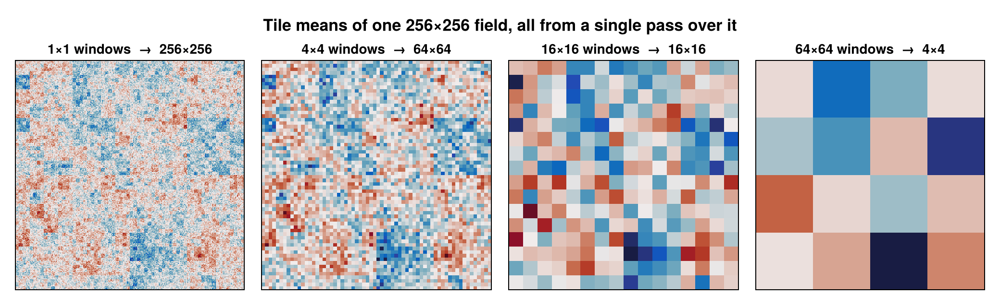
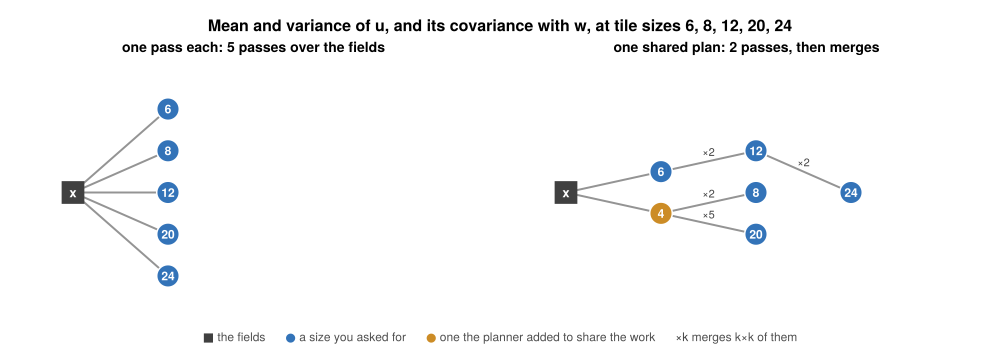
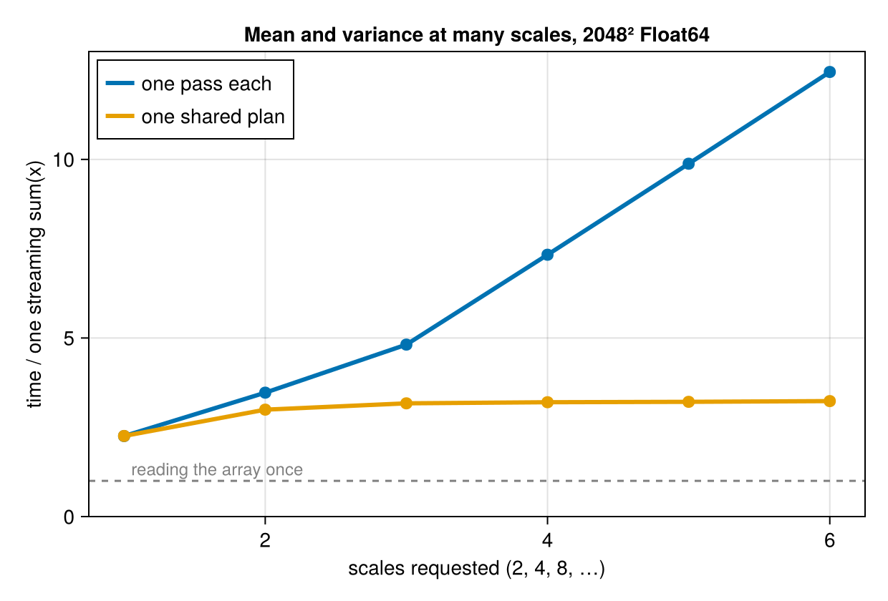

# BlockwiseStatisticalReductions.jl

Mergeable statistics of an N-dimensional tensor over **many window sizes at once**, computed by a planned
tree of reductions that touches the data as close to once as possible — on CPU, GPU, and across processes.

```julia
using BlockwiseStatisticalReductions

x = randn(4096, 4096)
r = blockstats(x, [2, 4, 8, 16, 32, 64]; stats = (Mean(), Var()))

r[(8, 8)].mean        # 512×512 array of tile means
r[(64, 64)].var       # 64×64 array of tile variances
```



## Why it is fast

Every statistic here is a mergeable monoid over sufficient statistics — a variance is `(n, mean, M2)`, and
two of those combine into one without revisiting the data. So a 64-cell tile is the merge of two 32-cell
tiles, a 12-cell window is a 8-cell window merged with a 4-cell one shifted by 8, and the sizes you asked
for can be built from each other instead of from the input.

The planner searches that space and picks the cheapest tree. Ask for five tile sizes and it will find the
one extra size that lets four of them share a parent:



The result is that cost stops growing with the number of scales:



## What you can ask for

Tiles, overlapping windows at any stride, dense windows, windows at hand-picked anchors — all the same
geometry object, all planned together, in any number of dimensions and with a different size per axis:


```julia
blockstats(x, ScaleSet(Sizes([16]); placement = Stride(4)); stats = (Mean(), Var()))
blockstats(x, ScaleSet((Dyadic(max = 64), Dyadic(max = 64), Fixed(1)); combine = Product()); stats = (Mean(),))
blockstats(x, spec; stats = (Mean(),), edge = Partial())     # keep the clipped edge, with its true counts
```

## What it computes

- **Many statistics, one pass.** Count, sum, mean, variance, standard deviation, min/max/extrema, raw and
  central moments, skewness, kurtosis, covariance, correlation, product mean — and the raw numerators
  behind them. Statistics of different fields fuse: `Var(:u)`, `Var(:w)` and `Cov(:u, :w)` cost one pass
  over both arrays, not three.

  ```julia
  blockstats((u = u, w = w), [8]; stats = (var_u = Var(:u), var_w = Var(:w), flux = Cov(:u, :w)))
  ```

- **Numerics that hold up.** Welford lifts, Chan/Pébay merges, two-pass second moments inside each box,
  and shifted accumulation so a `Float32` input with a large offset stays accurate in `Float32`.
- **Labelled axes.** Name the axes, give them coordinates, ask for sizes in physical units, and get back
  the true bounds of every output cell. Reads `DimArray`s, NetCDF variables and Zarr arrays directly.
- **Weights and gaps.** Per-element or separable per-axis weights, frequency and reliability corrections,
  and non-finite observations skipped per statistic.
- **Backends.** Serial, threaded (OhMyThreads), GPU (KernelAbstractions / CUDA), and two ways to span
  processes (MPI over a partitioned tensor, Distributed over scattered slabs) — all through the
  [ComputationalBackends.jl](https://github.com/jbphyswx/ComputationalBackends.jl) vocabulary.
- **Allocation-free steady state.** `prepare` once, `blockstats!` per input, zero bytes per call.

## Installation

```julia
import Pkg
Pkg.add(url = "https://github.com/jbphyswx/BlockwiseStatisticalReductions", subdir = "julia/BlockwiseStatisticalReductions.jl")
```

## Documentation

Concepts, worked examples and the API reference are in `docs/`; build them with
`julia --project=docs docs/make.jl`. Runnable scripts live in [`examples/`](examples). Upgrading from the previous
implementation is covered in [`MIGRATION.md`](MIGRATION.md), and [`AGENTS.md`](AGENTS.md) describes the layering.

A Python implementation of the same idea lives in `python/` at the repository root; it is independent of
this package.
