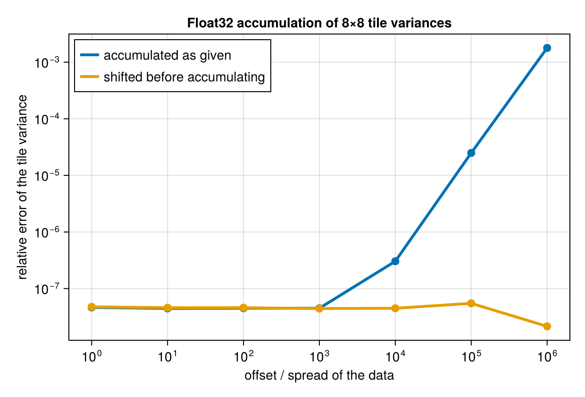

# Numerics

## What is computed

- Single observations enter through a Welford lift.
- Two accumulators combine with the Chan–Golub–LeVeque merge for `(n, mean, M2)`, and Pébay's forms for
  covariance and central moments to order four.
- Combining many at once uses the weighted-mean form — `mean = Σnᵢμᵢ / Σnᵢ`, `M2 = ΣM2ᵢ + Σnᵢ(μᵢ - μ)²` —
  never `Σx² - (Σx)²/n`.
- A base tile's second moments are computed in two passes over the box: the mean, then the centred sum.
  The box is in cache, so this is two passes over registers.

That combination gives error `O(ε‖x - μ‖²)` within a tile, which is the best attainable without
compensated summation.

## The limit that remains

Merging is not the weak link. Even with a perfect tree, the running means are stored at the data's own
magnitude, so a relative `M2` error of about `0.3 · ulp(|mean|) / scale` is inherent. Measured with
`n = 2×10⁴`, spread `10⁻³`:

| offset | relative M2 error |
|---|---|
| 0 | ~1e-16 |
| 1e4 | ≲ 1e-9 |
| 1e8 | 3e-6 to 1e-5 |

Sequential and pairwise merging give the same figure; tree order is for parallelism, not accuracy.

## Shifted accumulation

The fix is to accumulate statistics of `x - s` for one shift `s` per field per call. Central moments are
shift-invariant and means simply move by `s`, so `unshift` restores the reported values at finalize; by
Sterbenz the subtraction itself is exact when `s` is near the data.

This is what lets a `Float32` input accumulate in `Float32`. Measured per-tile variance against a
`BigFloat` reference, 8×8 tiles, spread `10⁻³`:

| mean / std | Float64 accumulation | Float32, unshifted | Float32, shifted |
|---|---|---|---|
| 0 | 4e-16 | 2.1e-7 | 1.8e-7 |
| 1e5 | 0 | 2.4e-4 | 2.5e-7 |
| 1e7 | 0 | 0.178 | 5.8e-8 |

The shift is global rather than per tile, so all accumulators still compose, and it is recomputed on every
call from a strided sample of at most `SHIFT_SAMPLES` elements — a prepared handle re-centres on each new
input.

`shift = :auto` (the default) shifts exactly where it buys something: a floating input whose accumulation
would otherwise have to widen. `Float64` input is already well conditioned and is left alone. `shift =
true` asks for it regardless, `false` refuses, and a number or tuple pins it.

Accumulators of raw, uncentered moments (`SumAcc`, `ProductSumAcc`, `RawMomentsAcc`) report
`shiftable = false`: un-shifting them would need quantities they do not carry, and they are well
conditioned without it.

## Element types

`accumulation_eltype` widens `Float16 → Float32`, `Float32 → Float64`, integers and `Bool → Float64`, and
leaves wider floats alone — but only when the request is not shifting. With a shift, a `Float32` input
accumulates in `Float32`, which is both faster and, at a large offset, far more accurate.

Results narrow exactly once, at finalize, to `result_eltype` — the input eltype for sums and extremes, a
float for means, moments and correlations. `acc_eltype` and `out_eltype` override both.

## Windows with nothing in them

A window can hold no observations once non-finite ones are [skipped](weights.md). Its mean and variance are
then `NaN`, not zero: the corrected denominator is clamped at zero so the division is `0/0`, and the mean
reports `NaN` directly. A sum of no observations is `0`, which is correct.
