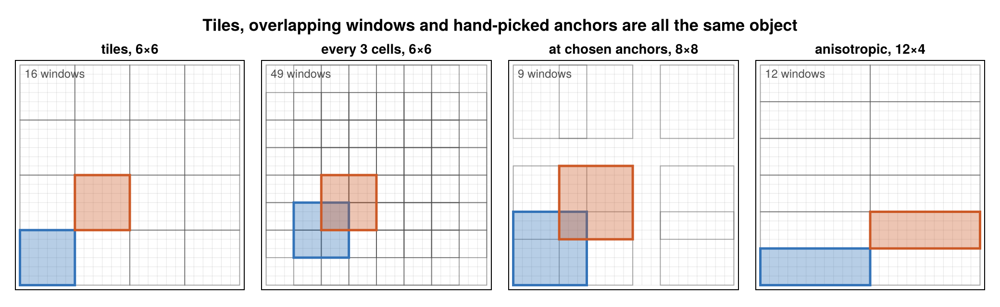

# Windows

A window is where a statistic is computed. Everything in this package — a tile, a sliding window, a set
of windows at hand-picked anchors — is the same object, which is what lets one planner span all of them.



## One axis at a time

An `AxisWindow` is `size` cells at a set of `positions` along an axis of `extent` cells. Origins are
0-based offsets, so the window at origin `o` covers 1-based indices `o+1 : o+size`.

Positions come in two forms:

- `Progression(offset, stride, count)` — an arithmetic progression. Tiles are the `stride == size` case;
  sliding windows are `stride < size`; `stride == 1` is dense.
- `Origins(v)` — an explicit sorted list, for windows at anchors that follow no pattern.

An N-dimensional `Window` is a tuple of one `AxisWindow` per axis, so anisotropy is free: 4 cells along
one axis and 32 along another is just two different `AxisWindow`s.

## Edges

An extent rarely divides by a window size. Four policies say what to do about the remainder:

| Policy | Behaviour |
|---|---|
| `Truncate()` | keep only whole windows; the tail is dropped (default) |
| `Partial()` | keep the trailing window, clipped, carrying its true smaller count |
| `Centered()` | like `Truncate`, with the remainder split evenly between both ends |
| `Strict()` | error unless the windows cover the axis exactly |

Padding is deliberately not offered: it would fabricate observations.

`Partial` is the one to reach for when nothing may be dropped. The counts on a clipped window are real —
a mean over a partial tile divides by the cells actually there — so partial windows merge correctly with
whole ones. A `Partial` request on an extent that happens to divide gives exactly the same windows,
counts and plan as `Truncate`.

## Deriving one window from another

Three relations decide what the planner is allowed to do, and each is a pure predicate with an
exhaustively tested definition:

- `can_coarsen(parent, child)` — every child window is `k` consecutive windows of a tiled parent.
- `can_compose(a, b, child)` — every child window is the `a` window at its origin followed by the `b`
  window at origin + `a.size`.
- `can_restride(parent, child)` — the child selects a subset of the parent's windows: a view, free.

These are the whole legality story. Kernels only ever evaluate merges the predicates have proven aligned,
and the tests check every true case against brute-force sets of covered indices on small extents.

## Where the output cells sit

`geometry(r, key)` reports it:

```julia
g = geometry(r, (8, 8))
g.origins     # 0-based origins per axis
g.ranges      # the input index range each output cell covers
g.bounds      # physical (low, high) per output cell, when a spacing is known
g.centers     # physical centres
```

That is the answer to "which cells went into this number", including under `Truncate`, where the dropped
tail differs per size.
